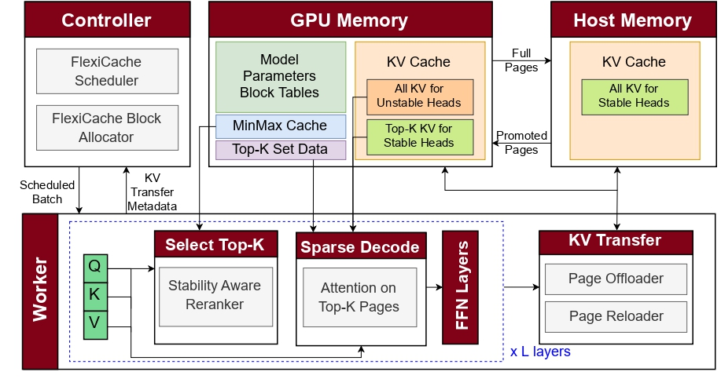
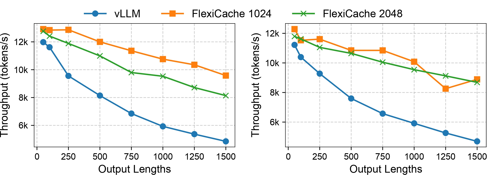
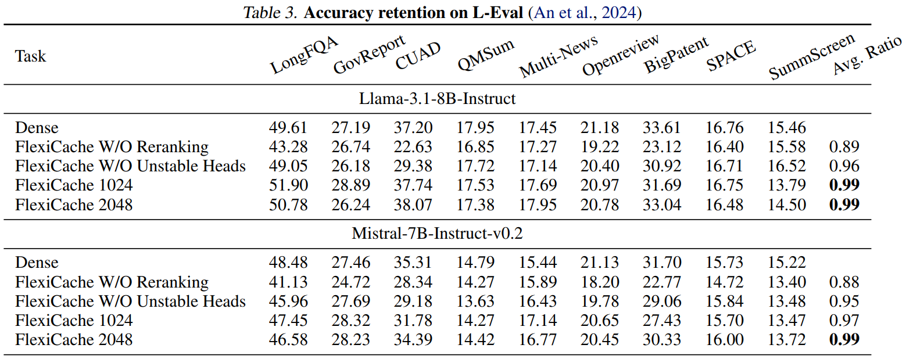
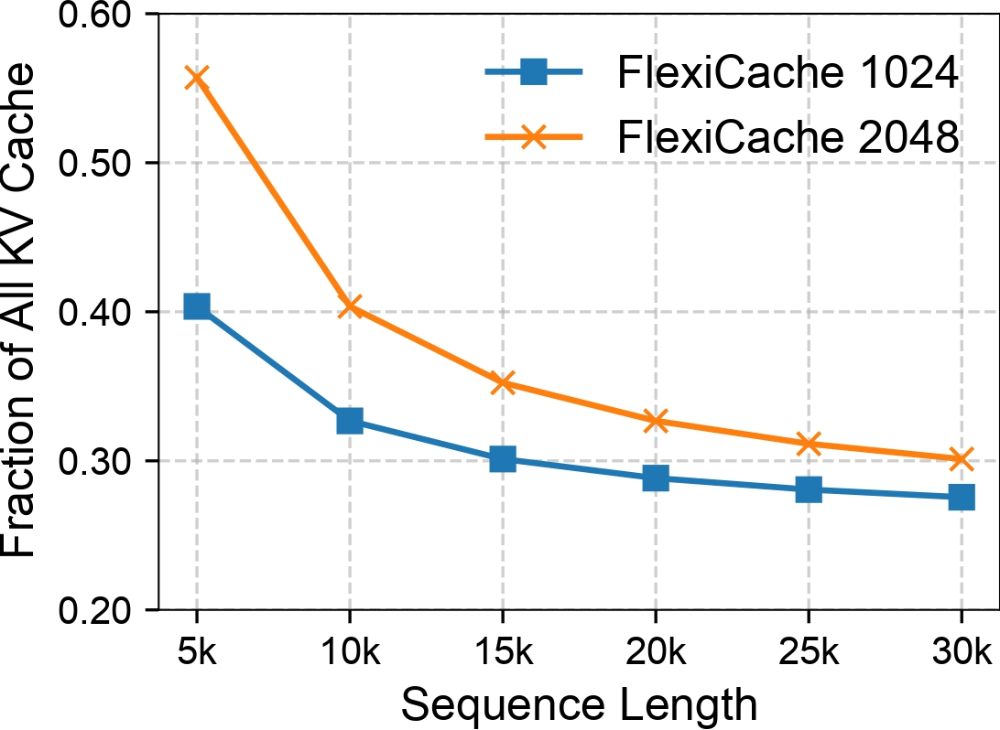

<h1 align="center">FlexiCache</h1>

<h3 align="center">Leveraging Temporal Stability of Attention Heads for Efficient KV Cache Management</h3>

<p align="center">
  <b>Accepted to MLSys 2026</b><br>
  Built on top of <a href="https://github.com/vllm-project/vllm">vLLM</a>
</p>

---

## Overview

Large Language Model (LLM) serving is increasingly bottlenecked by the size of the key-value (KV) cache, especially in **long-context** and **long-generation** workloads. While prior work has shown that only a small subset of tokens dominates attention at each decode step, exploiting this efficiently without hurting accuracy remains challenging.

**FlexiCache** is a hierarchical KV-cache management system that leverages a simple but powerful observation:

> **Attention heads differ in the temporal stability of their important KV pages.**  
> Some heads repeatedly attend to nearly the same top-K pages over time, while others shift focus frequently.

FlexiCache uses this observation to reduce GPU memory usage, attention computation, and host-device transfer overhead while preserving model quality.

---

## Core Insight

FlexiCache classifies KV heads into two groups:

- **Stable heads**: their top-K KV pages remain similar across nearby decode steps.
- **Unstable heads**: their top-K KV pages change frequently.

This distinction enables a more efficient hierarchical memory policy:

- For **unstable heads**, the full KV cache stays on the GPU.
- For **stable heads**, only the current top-K KV pages stay on the GPU, while the rest are offloaded to host memory.
- Stable heads are **periodically reranked**, and only newly promoted pages are transferred back to the GPU.

Unlike approaches that permanently discard less-important KV entries, FlexiCache retains the full context in host memory, so pages that become important later can still be recovered.

---

## Design Summary

<p align="center">
  
</p>

FlexiCache combines four ideas:

1. **Stability-aware head classification**  
   KV heads are profiled offline and classified as stable or unstable based on temporal stability.

2. **Hierarchical KV-cache placement**
   - Full KV cache for unstable heads on GPU
   - Top-K KV pages for stable heads on GPU
   - Remaining KV pages for stable heads in host memory

3. **Periodic reranking for stable heads**  
   Stable heads are reranked less frequently, reducing scoring overhead and host-device transfers.

4. **Sparse decode attention**  
   During decoding, attention is computed only on the selected top-K pages for each head.

---

## Performance Highlights

Across long-context and long-generation workloads, FlexiCache achieves:

- **Up to 70% reduction** in GPU KV-cache footprint
- **1.38×–1.55× higher offline serving throughput**
- **1.6×–2.1× lower online token latency**
- **Up to 4× decode-kernel speedup**
- **~99% of dense-attention accuracy** on evaluated benchmarks

<p align="center">
  
</p>
<p align="center">FlexiCache consistently outperforms vLLM on both Llama-3.1-8B and Mistral-7B in token throughput,
with gains increasing as output length grows. </p>

---

<p align="center">
  
</p>
<p align="center">Accuracy retention on <a href="https://aclanthology.org/2024.acl-long.776/">L-Eval</a> </p>

---

<p align="center">
  
</p>
<p align="center">GPU Memory Savings. Over 70% memory savings is
achieved at sequence lengths >20k with a token budget of 1024.</p>

---

## Testbed

### Hardware

- **GPU:** 1× NVIDIA H100 94GB NVL
- **Host memory:** >= 256 GB DDR5 RAM
- **Interconnect:** PCIe 5.0

FlexiCache requires a large pinned host-memory pool for KV offloading. By default, the host KV-cache size is set to **180 GB**, controlled by:

```
vllm/v1/flexicache/config.json
```

### Software

- **Python:** 3.12
- **PyTorch:** 2.6.0+cu124
- **Triton:** 3.2.0
- **Transformers:** 4.50.0
- **Datasets:** 3.6.0
- **CUDA runtime:** 12.8
- **NVIDIA driver:** 570.133.20

## Installation

FlexiCache is built on top of vLLM 0.8.2.

```bash
# Clone the repository
git clone git@github.com:NazmulTakbir/FlexiCache.git
cd FlexiCache

# Create and activate a Conda environment
conda create -n FlexiCache python=3.12 -y
conda activate FlexiCache

# Build the FlexiCache-modified vLLM from source
export MAX_JOBS=20   # Adjust based on your system capacity
pip install -e .     # builds vLLM from source (can take ~30 minutes)

# Install additional dependencies
pip install -r flexicache_requirements.txt
```

## Quick Start

FlexiCache uses V1 Triton attention backend of vLLM 0.8.2

```bash
export VLLM_ATTENTION_BACKEND="TRITON_ATTN_VLLM_V1"
export VLLM_USE_V1="1"
export TORCH_CUDA_ARCH_LIST="9.0;9.0a"

vllm serve meta-llama/Llama-3.1-8B-Instruct \
  --gpu-memory-utilization 0.95 \
  --tensor-parallel-size 1 \
  --no-enable-prefix-caching \
  --disable-cascade-attn \
  --max-num-batched-tokens 32768 \
  --max-num-seqs 32 \
  --rerank-frequency 16 \
  --topK-budget 64 \
  --num-unstable-heads 64 \
  --unstable_heads_profile_task gov_report \
  --enable-flexicache
```

_NB: FlexiCache loads custom CUDA kernels via torch.utils.cpp_extension.load. Limiting the build to specific architectures speeds up compilation. "9.0;9.0a" targets NVIDIA Hopper GPUs. Change this if using a different GPU._

### FlexiCache-specific options

- **rerank-frequency** 16: rerank stable heads every 16 decode steps
- **topK-budget**: number of KV pages used for sparse attention
- **num-unstable-heads**: number of heads that always keep full KV on GPU
- **unstable_heads_profile_task**: selects the precomputed head classification profile
- **enable-flexicache** enables FlexiCache

## Supported Models

FlexiCache currently includes stability profiling and head classification metadata for the following models:

- `meta-llama/Llama-3.1-8B-Instruct`
- `mistralai/Mistral-7B-Instruct-v0.2`
- `mistralai/Mistral-Small-24B-Instruct-2501`
- `Qwen/Qwen2.5-32B-Instruct`

Additional models can be supported by running the same offline stability analysis and generating the corresponding head classification metadata.

## Acknowledgements

FlexiCache is built on top of the <a href="https://github.com/vllm-project/vllm">vLLM</a> framework.

## Citation

If you use FlexiCache in your research, please cite our <a href="https://arxiv.org/abs/2511.00868">paper</a>:

```

@misc{takbir2025flexicacheleveragingtemporalstability,
title={FlexiCache: Leveraging Temporal Stability of Attention Heads for Efficient KV Cache Management},
author={Nazmul Takbir and Hamidreza Alikhani and Nikil Dutt and Sangeetha Abdu Jyothi},
year={2025},
eprint={2511.00868},
archivePrefix={arXiv},
primaryClass={cs.LG},
url={https://arxiv.org/abs/2511.00868},
}

```

## Contact

For questions about the paper or implementation, please contact:

**Nazmul Takbir**
ntakbir@uci.edu
